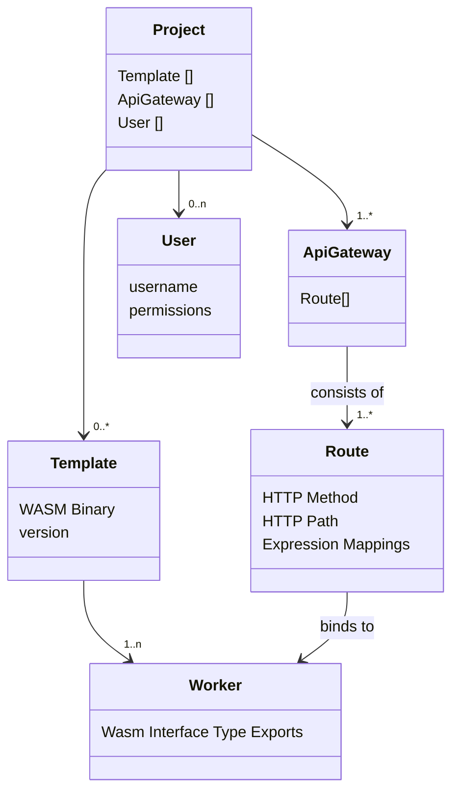

# Projects

The Golem Cloud Management Console isn't just a tool; it's a workspace tailored to your development needs. Here in the console, every project is more than just a collection of files and settings—it's a comprehensive environment equipped for the full lifecycle of serverless application development.

## Project Essentials

Projects in Golem Cloud provide a focused setting for your development, where you can access and manage all the critical components of your application:

- **Templates**: Start building with WebAssembly programs that make function deployment straightforward.
- **Workers**: Scale your application with live instances of your templates, handling tasks efficiently.
- **API Gateway**: Connect your services to the outside world with flexible and powerful interfaces.
- **Users**: Collaborate with your team, granting custom access to align with roles and responsibilities.

The diagram below shows how these parts work together in a project:

### Templates
Templates are the building blocks in Golem Cloud, reusable WebAssembly (WASM) programs. These templates are designed to serve as the foundation for your cloud services, ensuring quick deployment and consistent performance. With version control and the ability to maintain multiple WASM binaries, templates offer a scalable and flexible approach to managing application instances.

### Workers
Workers are the dynamic, executable instances of your templates with baked in durability. Use APIs to connect your workers to the outside world, and watch your cloud services come to life. 

### API Gateway
APIs are the interfaces that expose your workers to the world. Through these APIs, your workers can interact securely and reliably with clients, data sources, and other services.