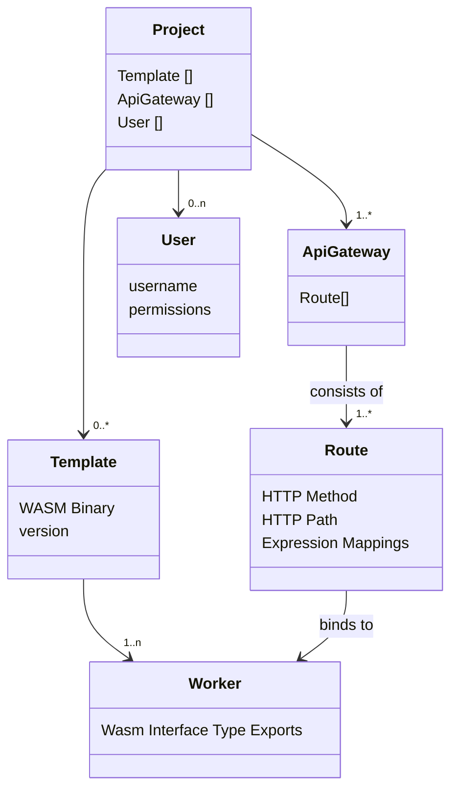

import { Steps } from "nextra/components"
import Image from 'next/image'

# Projects

Here in the console, every project is more than just a collection of files and settings—it's a comprehensive environment equipped for the full lifecycle of serverless application development.

## Project Essentials

Projects in Golem Cloud provide a focused setting for your development, where you can access and manage all the critical components of your application:

- **Templates**: Reusable WebAssembly programs are the foundation for your cloud services
- **Workers**: Workers are the dynamic, executable instances of your templates with baked in durability
- **API Gateway**: Build scalable APIs to expose your workers to the world
- **Users**: Collaborate with your team, granting custom access to align with roles and responsibilities.

The diagram below shows how these parts work together in a project:

## Creating your first Project
{/* prettier-ignore */}
<Steps>
    ### Go to the [management console](https://console.golem.cloud/)
    ### Find the `All Projects Page`

        Click on `Projects` in the top navigation bar
        <Image src="/images/projects-link.png" alt="All Projects" height={500} width={500} className="rounded-md"/>

    ### Click the `Create New` button in the top right
    ### Create the Project
        - Specify an **Project Name** and **Description**
</Steps>

